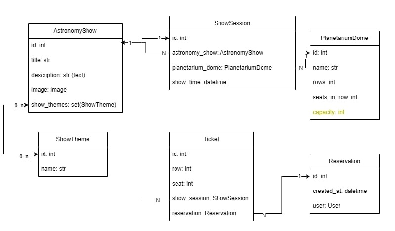

# Planetarium API

Planetarium API is a **RESTful web service** designed for managing digital planetarium systems. It provides robust endpoints for:
- Show, theme, planetarium dome management
- Reservation handling
- User JWT authentication

### 🔑 Test Access Recommendation
After installation, create your own superuser:
```sh
python manage.py createsuperuser
```

## ✨ Features
- **JWT Authentication** for secure access
- **RESTful Endpoints** for:
  - Astronomy shows and themes
  - Planetarium domes
  - Reservation management
- **Interactive API Documentation**
- **PostgreSQL Support**


---

## 🛠 Installation
### 1️⃣ Clone the Repository
```sh
git clone -b develop https://github.com/uzlss/planetarium-api.git
cd planetarium-api
```

### 2️⃣ Set Up Virtual Environment
```sh
python -m venv venv
# Windows:
venv\Scripts\activate
# macOS/Linux:
source venv/bin/activate
```

### 3️⃣ Install Dependencies
```sh
pip install -r requirements.txt
```

### 4️⃣ Configure Environment
Create a `.env` file:
- Rename `.env.sample` to `.env`
- Open the `.env` file and update the values according to your environment:

### 5️⃣ Run Migrations
```sh
python manage.py migrate
```

### 6️⃣ Start Development Server
```sh
python manage.py runserver
```

Access API documentation at: [http://localhost:8000/api/doc/swagger/](http://localhost:8000/api/doc/swagger/)

## 🐳 Docker Installation
### 1️⃣ Ensure Docker and Docker Compose are installed
Check if Docker is installed:
```sh
docker --version
docker-compose --version
```

### 2️⃣ Build and Start the Containers
Run the following command to start the API using `docker-compose.yaml`:
```sh
docker-compose up --build
```

### 3️⃣ Create a Superuser
```sh
docker-compose exec app python manage.py createsuperuser
```

### 4️⃣ Access the API
The API should be running at:
[http://localhost:8000](http://localhost:8000)


---

## 📊 Database Schema

